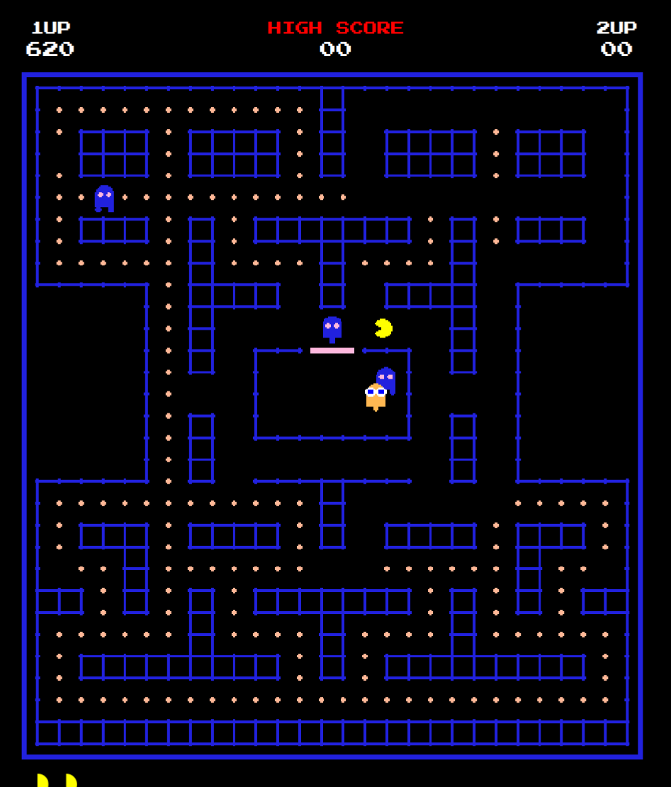

# Build Diary - Entry 01: Canvas Rendering System

**Date**: Session Day 1
**Phase**: TDD Implementation
**TDD Cycle**: RED → GREEN → REFACTOR

---

## The Problem I'm Solving

Before I can build any gameplay, I need a way to draw things on screen. The original Pac-Man ran on custom arcade hardware at 224×288 pixels. I need to recreate that authentic look using HTML5 Canvas, but I'm also aware that modern displays are much larger, so I'll need to scale everything up.

## Why I Chose These Specific Dimensions

The original game used 8×8 pixel tiles. After looking at the original sprite sheets and studying gameplay videos, I decided on a 2x scale factor:

- **Original**: 224×288 at 8×8 tiles
- **My version**: 448×576 at 16×16 tiles

Why 2x and not 3x or 4x? Because 2x keeps the chunky pixel aesthetic while being large enough to see clearly. Going larger would make it look too "blocky" and lose that retro charm. Plus, 448px is a comfortable width that doesn't overwhelm the screen.

## The Performance Problem I Anticipated

Here's something I learned from a previous canvas game project: redrawing the entire maze every frame is wasteful. The maze walls never change during gameplay. The pellets only disappear, never move. So why redraw them 60 times per second?

My solution: **offscreen canvas buffers**.

```
Frame Render Pipeline:
1. Draw maze buffer (pre-rendered) → Main canvas
2. Draw pellets buffer → Main canvas
3. Draw Pac-Man (calculated each frame)
4. Draw Ghosts (calculated each frame)
```

The maze and pellets are rendered once to separate canvases, then I just `drawImage()` them onto the main canvas each frame. This is essentially free from a CPU perspective compared to re-calculating all those wall positions.

When a pellet is eaten, I re-render just the pellets buffer. That's 244 small circles, which takes maybe 1-2ms. Still way better than doing it every frame.

## The Wall Rendering Challenge

This one gave me trouble. I started by just drawing filled rectangles for walls, but it looked awful—nothing like the original game's smooth, connected blue lines.

After studying screenshots more carefully, I realized the original doesn't draw walls as filled tiles. It draws the *edges* between walkable and non-walkable areas. Those glowing blue lines trace the boundary of the maze.

My approach evolved through three iterations:

**Attempt 1**: Fill wall tiles with blue → Looked blocky and wrong
**Attempt 2**: Draw lines connecting wall centers → Gaps at corners
**Attempt 3**: Check neighbors, draw connections with rounded caps → This works!

The final algorithm checks each wall tile's four neighbors. If a neighbor is also a wall, draw a line connecting them. The `lineCap: 'round'` CSS property handles the corners smoothly.

## The Pac-Man Mouth Math

Getting Pac-Man's mouth to open in the correct direction was trickier than expected. The Canvas `arc()` function takes start and end angles in radians, measured from the 3 o'clock position going clockwise.

For a mouth facing RIGHT:
- Mouth closed: Full circle (0 to 2π)
- Mouth open: Gap from -30° to +30° (so 0.17π to 1.83π)

But when Pac-Man faces LEFT, I need the gap on the other side. After several failed attempts with complex rotation math, I realized it's simpler to just calculate the angles directly for each direction:

```typescript
switch (direction) {
  case RIGHT: startAngle = mouthAngle; endAngle = 2π - mouthAngle;
  case LEFT:  startAngle = π + mouthAngle; endAngle = π - mouthAngle;
  case UP:    startAngle = -π/2 + mouthAngle; endAngle = -π/2 - mouthAngle + 2π;
  case DOWN:  startAngle = π/2 + mouthAngle; endAngle = π/2 - mouthAngle + 2π;
}
```

The animation cycles through 4 frames with different mouth openings: `[0, 0.15, 0.35, 0.15]` (as fractions of π). This gives the classic "wakka wakka" visual.

## Ghost Eyes: The Small Detail That Matters

Initially, I rendered ghosts with static eyes centered in their face. It looked wrong—lifeless.

Watching original gameplay footage, I noticed the ghost eyes actually track their movement direction. When Blinky is chasing you to the right, his pupils shift right. This tiny detail makes the ghosts feel predatory.

Implementation was straightforward:
```typescript
switch (direction) {
  case UP:    pupilOffsetY = -1.5; break;
  case DOWN:  pupilOffsetY = 1.5; break;
  case LEFT:  pupilOffsetX = -1.5; break;
  case RIGHT: pupilOffsetX = 1.5; break;
}
```

Small offset, big impact on the feel.

## Why I Put Score in the DOM, Not Canvas

I debated this one. The score display could be rendered directly on the canvas, but I chose to use DOM elements (the `<span id="score">` etc.) instead.

Reasons:
1. **Text rendering in Canvas is expensive** - Fonts have to be rasterized each frame
2. **CSS handles the retro font** - The "Press Start 2P" Google Font gives perfect arcade aesthetics
3. **Separation of concerns** - HUD elements don't need the 60fps update cycle
4. **Easier styling** - CSS animations for score popups are trivial

The score only updates when something is eaten, so there's no point re-rendering it every frame.

## What I'd Do Differently

If starting over, I'd consider using WebGL instead of Canvas 2D. The sprite batching would be much more efficient. But for this scope—a single-screen game with maybe 10 moving entities—Canvas 2D is plenty fast and much simpler to work with.

## Test Coverage

I wrote tests before implementing:
- Canvas initialization throws on missing element (caught a bug during development)
- Dimensions match expected values
- Buffer rendering actually happens
- Pellet state tracks eaten pellets correctly
- Entity rendering calls the right drawing methods

The tests caught an issue where I was using `width` instead of `CANVAS_WIDTH` in one place. TDD pays off.

## Next Up

With rendering working, I need to actually have something to render. Next: the Pac-Man entity with keyboard controls and collision detection against the maze walls.

---

**Time spent on this phase**: ~2 hours
**Lines of code**: ~350
**Tests written**: 21
**Tests passing**: 21
**Refactor iterations**: 3 (walls), 2 (mouth animation)

---

## Screenshot


